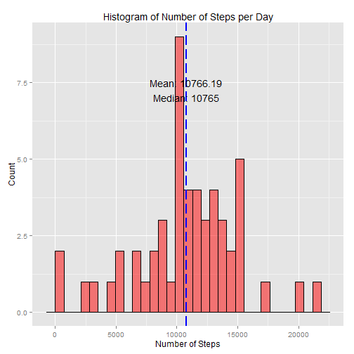
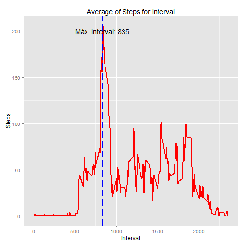
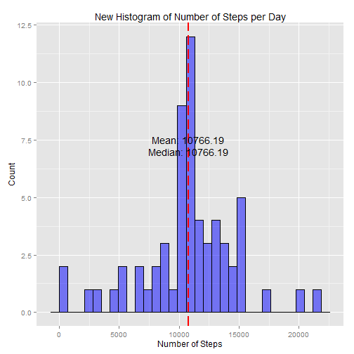
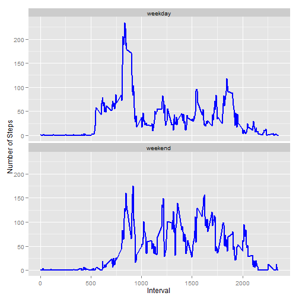

# Reproducible Research: Peer Assessment 1
This assignment makes use of data from a personal activity monitoring device. This device collects data at 5 minute intervals through out the day. The data consists of two months of data from an anonymous individual collected during the months of October and November, 2012 and include the number of steps taken in 5 minute intervals each day.


## Loading and preprocessing the data
The variables included in this dataset are:

**. steps:** Number of steps taking in a 5-minute interval (missing values are coded as NA)

**. date:** The date on which the measurement was taken in YYYY-MM-DD format

**. interval:** Identifier for the 5-minute interval in which measurement was taken

Reading data:

1. Download the data.
2. Load the data.


```r
library(ggplot2)
# Read data csv.
data <- read.csv("activity.csv", header = TRUE, na.strings = c("NA"))

# Type variables
data$steps <- as.numeric(data$steps)
data$date <- as.Date(data$date, format = "%Y-%m-%d")
data$interval <- as.factor(data$interval)

# Summary data
head(data)
```

```
##   steps       date interval
## 1    NA 2012-10-01        0
## 2    NA 2012-10-01        5
## 3    NA 2012-10-01       10
## 4    NA 2012-10-01       15
## 5    NA 2012-10-01       20
## 6    NA 2012-10-01       25
```

```r
str(data)
```

```
## 'data.frame':	17568 obs. of  3 variables:
##  $ steps   : num  NA NA NA NA NA NA NA NA NA NA ...
##  $ date    : Date, format: "2012-10-01" "2012-10-01" ...
##  $ interval: Factor w/ 288 levels "0","5","10","15",..: 1 2 3 4 5 6 7 8 9 10 ...
```

```r
summary(data)
```

```
##      steps            date               interval    
##  Min.   :  0.0   Min.   :2012-10-01   0      :   61  
##  1st Qu.:  0.0   1st Qu.:2012-10-16   5      :   61  
##  Median :  0.0   Median :2012-10-31   10     :   61  
##  Mean   : 37.4   Mean   :2012-10-31   15     :   61  
##  3rd Qu.: 12.0   3rd Qu.:2012-11-15   20     :   61  
##  Max.   :806.0   Max.   :2012-11-30   25     :   61  
##  NA's   :2304                         (Other):17202
```

```r
np <- dim(data)
n <- np[1]
p <- np[2]
```


There are 3 variables and 17568 observations.

## What is mean total number of steps taken per day?

For this part of the assignment, you can ignore the missing values in the dataset.


```r
# Sum Steps by day
steps_day <- aggregate(steps ~ date, data, sum)
colnames(steps_day) <- c("date", "steps")
```


*1. Make a histogram of the total number of steps taken each day*


```r
# Mean and median
mean <- round(mean(steps_day$steps), 2)
median <- round(median(steps_day$steps), 2)

# Names mean and median
name_mean <- paste("Mean: ", mean, sep = "")
name_median <- paste("Median: ", median, sep = "")

# Graph using ggplot2
ggplot(steps_day, aes(x = steps)) + geom_histogram(fill = I("red"), alpha = I(0.5), 
    color = I("black")) + labs(title = "Histogram of Number of Steps per Day", 
    x = "Number of Steps", y = "Count") + geom_vline(xintercept = mean, colour = "green", 
    linetype = "longdash", size = 1) + geom_vline(xintercept = median, colour = "blue", 
    linetype = "longdash", size = 1) + annotate("text", x = mean, y = 7.5, label = name_mean) + 
    annotate("text", x = median, y = 7, label = name_median)
```

```
## stat_bin: binwidth defaulted to range/30. Use 'binwidth = x' to adjust this.
```

 


*2. Calculate and report the mean and median total number of steps taken per day*

**- Mean: 10766.19**  
**- Median: 10765**

## What is the average daily activity pattern?

*1. Make a time series plot (i.e. type = "l") of the 5-minute interval (x-axis) and the average number of steps taken, averaged across all days (y-axis)*


```r
# Steps by Interval
steps_interval_data <- function(data) {
    steps_interval <- aggregate(data$steps, by = list(interval = data$interval), 
        FUN = mean, na.rm = T)
    # Convert to integers for plotting
    steps_interval$interval <- as.integer(levels(steps_interval$interval)[steps_interval$interval])
    colnames(steps_interval) <- c("interval", "steps")
    steps_interval
}

steps_interval <- steps_interval_data(data)

# Max interval
max_interval <- steps_interval[steps_interval$steps == max(steps_interval$steps), 
    ]
interval_max <- as.numeric(max_interval[1])
average_max <- as.numeric(max_interval[2])
name_interval <- paste("Máx_interval: ", interval_max, sep = "")

# Graph using ggplot2
ggplot(steps_interval, aes(x = interval, y = steps)) + geom_line(color = "red", 
    size = 1) + labs(title = "Average of Steps for Interval", x = "Interval", 
    y = "Steps") + geom_vline(xintercept = interval_max, colour = "blue", linetype = "longdash", 
    size = 1) + annotate("text", x = interval_max, y = 200, label = name_interval)
```

 


*2. Which 5-minute interval, on average across all the days in the dataset, contains the maximum number of steps?*

The **835<sup>th</sup> interval** has the maximum activity on the average (average= 206.1698).


## Imputing missing values

Note that there are a number of days/intervals where there are missing values (coded as NA). The presence of missing days may introduce bias into some calculations or summaries of the data.

*1. Calculate and report the total number of missing values in the dataset (i.e. the total number of rows with NAs)*

```r
count_NA <- sum(is.na(data$steps))
```

Number of missing values: **2304**

*2. Devise a strategy for filling in all of the missing values in the dataset. The strategy does not need to be sophisticated. For example, you could use the mean/median for that day, or the mean for that 5-minute interval, etc.*


```r
complete <- function(datos) {
    datos <- data
    indices_na <- which(is.na(datos$steps))
    n <- length(indices_na)
    # Computing Average Steps by Interval
    steps_interval <- steps_interval_data(datos)
    # Replacing missing values if they have Interval equal
    for (i in 1:n) {
        interval_vacios <- datos[indices_na[i], 3]
        value <- steps_interval[steps_interval$interval == interval_vacios, 
            2]
        datos[indices_na[i], 1] <- value
    }
    return(datos)
}
```


*3. Create a new dataset that is equal to the original dataset but with the missing data filled in.*

```r
datos_complete <- complete(data)

summary(datos_complete)
```

```
##      steps            date               interval    
##  Min.   :  0.0   Min.   :2012-10-01   0      :   61  
##  1st Qu.:  0.0   1st Qu.:2012-10-16   5      :   61  
##  Median :  0.0   Median :2012-10-31   10     :   61  
##  Mean   : 37.4   Mean   :2012-10-31   15     :   61  
##  3rd Qu.: 27.0   3rd Qu.:2012-11-15   20     :   61  
##  Max.   :806.0   Max.   :2012-11-30   25     :   61  
##                                       (Other):17202
```


*4. Make a histogram of the total number of steps taken each day and Calculate and report the mean and median total number of steps taken per day. Do these values differ from the estimates from the first part of the assignment? What is the impact of imputing missing data on the estimates of the total daily number of steps?*


```r
# Sum Steps by day
steps_day_complete <- aggregate(steps ~ date, datos_complete, sum)
colnames(steps_day_complete) <- c("date", "steps")

# Mean and median
mean <- round(mean(steps_day_complete$steps), 2)
median <- round(median(steps_day_complete$steps), 2)

# Names mean and median
name_mean <- paste("Mean: ", mean, sep = "")
name_median <- paste("Median: ", median, sep = "")

# Graph using ggplot2
ggplot(steps_day_complete, aes(x = steps)) + geom_histogram(fill = I("blue"), 
    alpha = I(0.5), color = I("black")) + labs(title = "New Histogram of Number of Steps per Day", 
    x = "Number of Steps", y = "Count") + geom_vline(xintercept = mean, colour = "green", 
    linetype = "longdash", size = 1) + geom_vline(xintercept = median, colour = "red", 
    linetype = "longdash", size = 1) + annotate("text", x = mean, y = 7.5, label = name_mean) + 
    annotate("text", x = median, y = 7, label = name_median)
```

```
## stat_bin: binwidth defaulted to range/30. Use 'binwidth = x' to adjust this.
```

 


**- Mean: 10766.19**  
**- Median: 10766.19**

Comparing with the calculations done in the first section of this document, we observe that the mean value remains unchanged, but the median value has shifted closer to the mean and the histogram changed somewhat.

## Are there differences in activity patterns between weekdays and weekends?

For this part the weekdays() function may be of some help here. Use the dataset with the filled-in missing values for this part.

*1. Create a new factor variable in the dataset with two levels - "weekday" and "weekend" indicating whether a given date is a weekday or weekend day.*


```r
# Sábado and domingo are weekend in Spañish
data$weekday <- weekdays(data$date) %in% c("sábado", "domingo")
data$weekday <- ifelse(data$week == "TRUE", "weekend", "weekday")
```


*2. Make a panel plot containing a time series plot (i.e. type = "l") of the 5-minute interval (x-axis) and the average number of steps taken, averaged across all weekday days or weekend days (y-axis).*


```r
data_weekday <- subset(data, !weekday %in% c("weekend"))
data_weekend <- subset(data, weekday %in% c("weekend"))

# Steps by Interval weekend
data_weekday_steps <- steps_interval_data(data_weekday)
data_weekend_steps <- steps_interval_data(data_weekend)

data_weekday_steps$weekday <- rep("weekday", nrow(data_weekday_steps))
data_weekend_steps$weekday <- rep("weekend", nrow(data_weekend_steps))

data_weekday <- rbind(data_weekday_steps, data_weekend_steps)
data_weekday$weekday <- as.factor(data_weekday$weekday)

# Plot
ggplot(data_weekday, aes(x = interval, y = steps)) + geom_line(color = "blue", 
    size = 1) + facet_wrap(~weekday, nrow = 2, ncol = 1) + labs(x = "Interval", 
    y = "Number of Steps")
```

 

